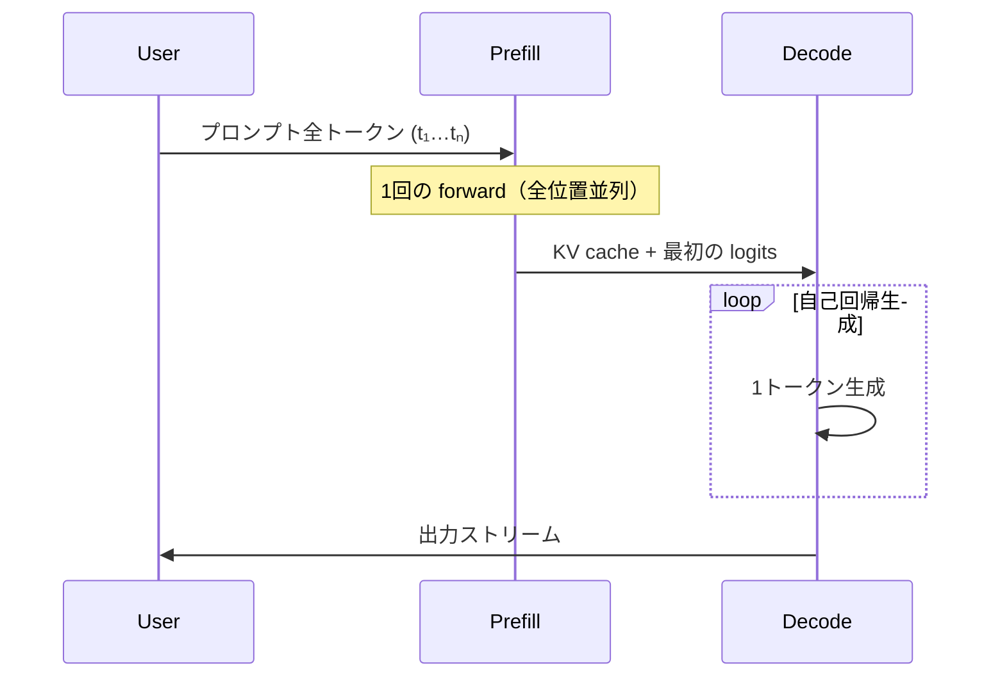
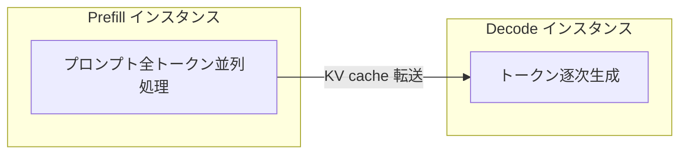

# LLM推論のPrefill詳説 ― トークン並列・Chunked Prefill・PD分離

作成日時: 2026-05-23 16:03:04
更新日時: 2026-05-23 16:30:00

## 概要

LLMの推論は **Prefill（プロンプト処理）** と **Decode（トークン生成）** の2フェーズに分かれます。Prefill ではプロンプトの全トークンが最初から既知なため、因果マスクの制約のもとで **各トークン位置を1回の forward pass で並列計算** できます。Decode では自己回帰的に **1トークンずつ逐次生成** するため、並列性はリクエスト内では使えません。

本記事では次を順に説明します。

1. Prefill と Decode の違い（計算特性・ボトルネック）
2. Prefill におけるトークン並列処理の仕組み
3. 単一GPU内の最適化（FlashAttention、PagedAttention 等）
4. サービング向け最適化（Chunked Prefill、Prefill-Decode 分離）
5. 混同しやすい概念との整理

推論ランタイム全体の選定・比較は [LLM推論ランタイムまとめ](LLM推論ランタイムまとめ.md) を参照してください。

## [ch] Prefill と Decode の2フェーズ

Transformer ベースの LLM 推論は、大きく次の2段階で構成されます。

| フェーズ | 入力 | 並列性 | 典型的なボトルネック |
|:--|:--|:--|:--|
| **Prefill** | 既知の全プロンプトトークン | 全位置を1回（または少数回）の forward で並列計算 | 計算量（Compute-bound） |
| **Decode** | これまでに生成したトークン | 1トークンずつ逐次生成 | メモリ帯域（Memory-bound） |

### Prefill フェーズ

ユーザーが送ったプロンプト（システムプロンプト、会話履歴、RAG で取得した文書など）を処理し、各 Transformer 層の **KV cache** を構築します。Prefill が終わると、最後の位置の logits から最初の出力トークンがサンプリングされ、Decode フェーズへ移ります。

**Time To First Token（TTFT）** は主に Prefill の長さと処理速度に依存します。プロンプトが長いほど TTFT は伸びます。

### Decode フェーズ

生成されたトークンを1つずつ入力に足しながら、次のトークンを予測します。各ステップでは新しいトークン1つ分の Q/K/V 計算と、過去全トークン分の KV cache 参照が必要です。

**Inter-Token Latency（ITL）** または **Time Per Output Token（TPOT）** は Decode の速度を表します。バッチサイズが小さいほど GPU の演算ユニットは遊び、代わりに KV cache の読み出しが支配的になります。

### フェーズの流れ（概念図）



## [ch] Prefill におけるトークン並列処理

「Prefill を各トークンごとに並列で処理する」とは、**プロンプトの全トークン位置について、1回の forward pass 内で行列演算として同時に計算する** ことを指します。

### Decode との対比

```
Prefill:  [t₁][t₂][t₃]…[tₙ]  ──→ 1回の forward（全位置を並列）
Decode:   [t₁] → [t₂] → [t₃] → …  ──→ N回の forward（逐次）
```

Decode では次のトークンが前のトークンの結果に依存するため、リクエスト内では並列化できません。Prefill ではプロンプト全体が確定しているため、因果 Attention の制約（位置 i は位置 1…i までしか参照しない）のもとで **全位置の計算を同じカーネル内で並列実行** できます。

### 1回の forward pass で起きること

プロンプト長 \(S\) の入力に対し、おおよそ次が一括で行われます。

1. **Embedding**: 全 \(S\) トークンを `(batch × S × hidden_dim)` のテンソルに変換
2. **Attention**: 全位置の Q, K, V をまとめて計算し、因果マスク付きで Attention スコアを求める
3. **FFN**: 各位置に独立に Feed-Forward を適用
4. **KV cache 書き込み**: 全層・全位置の K, V をキャッシュに保存

GPU 上では `Q @ K^T` などの大きな GEMM（行列積）として処理されるため、演算ユニットを効率的に使えます。これが Prefill が **Compute-bound** になりやすい理由です。

### なぜ Prefill が長いと支配的になるか

| プロンプト長 | Prefill の影響 | Decode の影響 |
|:--|:--|:--|
| 短い（数百トークン） | 相対的に小さい | 生成長に比例して支配的 |
| 長い（数千〜数万トークン） | TTFT・スループットを大きく左右 | 1トークンあたりのコストは変わらない |

RAG や長文要約、エージェントの長いコンテキストでは Prefill 性能がボトルネックになりやすいです。ベンチマークでも **Prefill と Decode を分けて測定** することが重要です（[LLM推論ランタイムまとめ](LLM推論ランタイムまとめ.md) の「性能比較の目安」参照）。

## [ch] 単一GPU内の Prefill 最適化

Prefill の「トークン並列」は、まず **1 GPU 内で全シーケンス位置を効率よく同時処理する** 方向の最適化です。

### FlashAttention / FlashInfer

標準的な Attention 実装では、中間の Attention 行列 \((S \times S)\) を HBM に書き出すとメモリと帯域を大量に消費します。**FlashAttention** はタイル単位で Attention を計算し、中間結果の materialize を避けます。長い Prefill ほど効果が大きく、vLLM・SGLang・TensorRT-LLM など主要ランタイムは FlashAttention 系カーネル（FlashInfer 等）を統合しています。Unsloth Studio の GGUF パス（llama-server）でも `--flash-attn on` が既定で有効です。

### PagedAttention（vLLM）

KV cache を固定長の **ブロック（ページ）** に分割して管理します。Continuous batching と組み合わせることで、複数リクエストの Prefill を効率的にバッチ化し、メモリ断片化を抑えます。

### Prefix Caching / RadixAttention

**同じプロンプト prefix**（システムプロンプト、Few-shot 例、RAG で共通の文書など）を再利用する場合、Prefill 済みの KV cache を **再計算せず参照** できます。

- vLLM: Automatic Prefix Caching（ブロックハッシュベース）
- SGLang: RadixAttention（radix tree による prefix 共有）

これは「並列化」ではなく **Prefill の省略** ですが、実務上 TTFT 改善に直結します。

### 長コンテキストでのマルチGPU並列

1 GPU のメモリ・演算量の限界を超えるシーケンス長では、次の並列化が使われます。

| 方式 | 分割軸 | Prefill への効果 |
|:--|:--|:--|
| **Tensor Parallelism** | モデルの重み | 層内演算を複数 GPU に分散 |
| **Sequence Parallelism / Ring Attention** | シーケンス次元 | 長い Prefill を複数 GPU で分担 |

## [ch] Chunked Prefill

**Chunked Prefill** は、[Sarathi-Serve](https://arxiv.org/abs/2403.02310) で提案された、**サービング時のスケジューリング** 向け最適化です。Prefill そのものの「トークン並列」の仕組みを変えるのではなく、**長い Prefill を時間軸上で分割** します。

### 背景：Prefill が Decode をブロックする問題

Continuous batching を使う推論サーバでは、新規リクエストの Prefill がバッチに割り込むと、進行中の Decode が **1イテレーション分まるごと停止** します（generation stall）。長いプロンプトの Prefill は計算量が大きいため、他リクエストの ITL が悪化します。

### 仕組み

長い Prefill を **512〜8192 トークン程度のチャンク** に分割し、各チャンクを Decode バッチに **混ぜて（piggyback）** 処理します。

```
従来:  [======== 長い Prefill ========] → decode → decode → …
Chunked: [Prefill chunk 1] + decode
         [Prefill chunk 2] + decode
         [Prefill chunk 3] + decode  …
```

### 効果とトレードオフ

| 観点 | 効果 |
|:--|:--|
| **ITL / TPOT** | Decode 中の完全停止が減り、トークン生成が「一時停止」から「やや遅延」に変わる |
| **スループット** | Decode フェーズの計算余裕（slack）を Prefill に再利用できる |
| **TTFT** | チャンク分割のオーバーヘッドで、わずかに増えることがある |
| **Attention 効率** | チャンクごとのカーネル起動で、連続 Prefill より効率が落ちる場合がある |

[Hugging Face の解説](https://huggingface.co/blog/tngtech/llm-performance-prefill-decode-concurrent-requests) では、chunk size を **512〜8192** 程度で調整する例が紹介されています。vLLM の chunked prefill は多くのデプロイでデフォルト有効です。

**Chunk size は TTFT と ITL のつまみ** です。小さくすると ITL 優先、大きくすると TTFT・Prefill 効率優先になります。

## [ch] Prefill-Decode 分離（PD Disaggregation）

**Prefill-Decode 分離**（PD Disaggregation）は、Prefill と Decode を **別の GPU インスタンス（または別プロセス）** に物理的に分ける方式です。[Splitwise](https://arxiv.org/abs/2401.10241)、[DistServe](https://arxiv.org/abs/2401.09652)、vLLM の [Disaggregated Prefilling](https://docs.vllm.ai/en/stable/features/disagg_prefill/) などが代表例です。

### 仕組み



1. **Prefill インスタンス** がプロンプトを処理し KV cache を生成
2. 高速インターコネクト（NVLink、InfiniBand 等）で **Decode インスタンスへ KV cache を転送**
3. **Decode インスタンス** が自己回帰生成を担当

GQA（Grouped Query Attention）や MLA（Multi-head Latent Attention）など KV cache が圧縮されたアーキテクチャでは、転送コストが相対的に小さくなり PD 分離が現実的です。

### Chunked Prefill との比較

| 方式 | アプローチ | 長所 | 短所 |
|:--|:--|:--|:--|
| **Chunked Prefill** | 同一 GPU 上で Prefill を分割し Decode と混在 | 追加ハード不要、導入が容易 | chunk size のチューニングが難しい場合がある |
| **PD 分離** | Prefill と Decode を別インスタンスに配置 | TTFT と ITL を独立にスケール、tail ITL の制御がしやすい | KV 転送の設計、2系統の運用が必要 |

vLLM のドキュメントでは、tail ITL を確実に抑えたい場合 **PD 分離の方が chunk size 調整より信頼しやすい** と述べられています。一方、Chunked Prefill は追加インフラなしで多くのケースに効く **デフォルト戦略** として広く使われています。

## [ch] 混同しやすい概念

| 概念 | 何を最適化するか | Prefill との関係 |
|:--|:--|:--|
| **Prefill のトークン並列** | 1 forward で全プロンプト位置を計算 | Prefill の基本動作 |
| **Chunked Prefill** | 長い Prefill のスケジューリング分割 | サービング時の ITL 改善 |
| **PD 分離** | Prefill と Decode の物理分離 | TTFT / ITL の独立チューニング |
| **Prefix Caching** | 既計算 KV の再利用 | Prefill 計算の省略 |
| **Speculative Decoding** | 複数トークン候補の投機的生成 | **Decode** の高速化（Prefill とは別） |
| **Continuous Batching** | リクエストの動的バッチング | Prefill / Decode 両方に効く |

## [ch] 実務での見方

### 測るべき指標

| 指標 | 主に反映するフェーズ |
|:--|:--|
| **TTFT** | Prefill |
| **ITL / TPOT** | Decode |
| **スループット（tokens/s）** | 両方（ワークロード依存） |

長いプロンプトが多いワークロード（RAG、エージェント、長文入力）では Prefill 性能と prefix caching の効果を重点的に見ます。多ユーザー同時接続では Chunked Prefill や PD 分離による ITL の安定性が重要です。

### 主要ランタイムでの対応（2026年時点）

| ランタイム | Prefill 関連機能 |
|:--|:--|
| **vLLM** | chunked prefill、Automatic Prefix Caching、Disaggregated Prefilling（実験的） |
| **SGLang** | chunked prefill、RadixAttention、prefill/decode 分離 |
| **llama.cpp** | 単一リクエストでは Prefill を1 pass で処理。サーバ用途では continuous batching 等 |
| **TensorRT-LLM** | inflight batching、KV cache 再利用・オフロード |
| **Unsloth** | **GGUF**: llama-server 経由（FlashAttention 有効、Prefill は llama.cpp 同様に 1 pass 並列）。**safetensors**: `FastLanguageModel.for_inference()` による HF generate（単一リクエスト逐次、chunked prefill / prefix caching / PD 分離は非対応） |

Unsloth は vLLM / llama.cpp の完全代替ではなく、Triton カーネル等の独自最適化を載せた AI infra です。Prefill の本番サービング最適化（chunked prefill、PD 分離、prefix caching）は、GGUF / safetensors を vLLM / SGLang / llama-server 単体にエクスポートして委ねる構成が一般的です。

詳細は [LLM推論ランタイムまとめ](LLM推論ランタイムまとめ.md) を参照してください。

## まとめ

- LLM 推論は **Prefill（プロンプト処理）** と **Decode（トークン生成）** に分かれ、計算特性が大きく異なる
- Prefill ではプロンプト全トークンが既知なため、因果マスク付きで **全位置を1回の forward で並列計算** できる。Decode は **1トークンずつ逐次**
- 単一 GPU 内では FlashAttention・PagedAttention 等が Prefill の効率を支える
- サービングでは **Chunked Prefill**（スケジューリング分割）と **PD 分離**（物理分離）が ITL と TTFT のトレードオフを改善する
- **Prefix Caching** は Prefill の再計算を省略し、**Speculative Decoding** は Decode 向けの別系統の高速化
- **Unsloth** は推論エンジン代替ではなく AI infra（独自カーネル + 既存エコシステム）。Prefill のサービング最適化は下流エンジンに委ねる前提

## 参考リンク

- [Sarathi-Serve: Efficient LLM Inference by Piggybacking Decodes with Chunked Prefills](https://arxiv.org/abs/2403.02310)
- [Splitwise: Efficient Generative LLM Inference Using Phase Splitting](https://arxiv.org/abs/2401.10241)
- [DistServe: Disaggregating Prefill and Decoding for Goodput-optimized LLM Serving](https://arxiv.org/abs/2401.09652)
- [Prefill and Decode for Concurrent Requests（Hugging Face Blog）](https://huggingface.co/blog/tngtech/llm-performance-prefill-decode-concurrent-requests)
- [Disaggregated Prefilling（vLLM Docs）](https://docs.vllm.ai/en/stable/features/disagg_prefill/)
- [Unsloth Inference（Core）](https://unsloth.ai/docs/basics/inference-and-deployment/unsloth-inference)
- [Unsloth API エンドポイント](https://unsloth.ai/docs/basics/api)
- [LLM推論ランタイムまとめ](LLM推論ランタイムまとめ.md)
